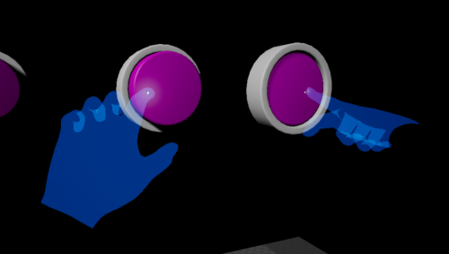
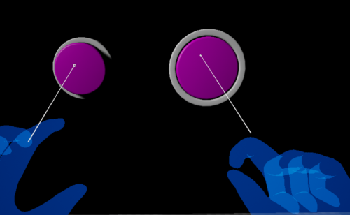

# Hand interaction

Hand interaction with UX elements is performed via the *hand interaction actor*. This actor takes care of creating and driving the pointers and visuals for near and far interactions. 

Near interactions are performed by either _grabbing_ elements pinching them between index and thumb or _poking_ at them with the finger tip. 
While in near interaction mode a _finger cursor_ is displayed on the finger tip to provide feedback about the closest poke target.

Far interacions are performed pointing via a ray attached to the hand with selection triggered by pressing index and thumb tips together. 
A _far beam_ is displayed representing the ray shooting out of the hand. 
At the end of the beam a _far cursor_ gives feedback about the current far target. 

 Poke and grab targets are defined by adding a component implementing the *grab target interface* and *poke target interface*.
 All visible objects with collision will be hit by the far ray by default but only components implementing the *far target interface* will receive far interaction events.
 Provided UX elements like the _pressable button_ implement these interfaces to use interactions to drive their state.

## Hand interaction actor

Add a <xref:_a_uxt_hand_interaction_actor> to the world per hand in order to be able to interact with UX elements. 
There is no other additional setup required, just remember to set the actors to different hands via their *Hand* property as by default they use the left hand.
 See _MRPawn_ in _UXToolsGame_ for an example of hand interaction setup.

The actor will automatically create the required components for near and far pointers and their visualization. 
Properties controlling the setup of these are exposed in the actor directly. 
A few ones deserving special attention are explained in the following sections.

### Near activation distance

Each hand will transition automatically from far to near interaction mode when close enough to a near interaction target. 
The near activation distance defines how close the hand must be to the target for this to happen.

### Trace channel

The hand actor and its pointers perform a series of world queries to determine the current interaction target. 
The trace channel property is used to filter the results of those queries.

### Default visuals

Default visuals are created for near and far cursor and far beam in the form of the following components:

- Near cursor: <xref:_u_uxt_finger_cursor_component>
- Far cursor: <xref:_u_uxt_far_cursor_component>
- Far beam: <xref:_u_uxt_far_beam_component>

In order to allow for custom visuals, their creation can be individually disabled via properties in the advanced section of the _Hand Interaction_ category.

## See also

- [Mixed Reality Instinctual Interactions](https://docs.microsoft.com/en-us/windows/mixed-reality/interaction-fundamentals): design principles behind the interaction model.
- <xref:_i_uxt_grab_target>
- <xref:_i_uxt_poke_target>
- <xref:_i_uxt_far_target>